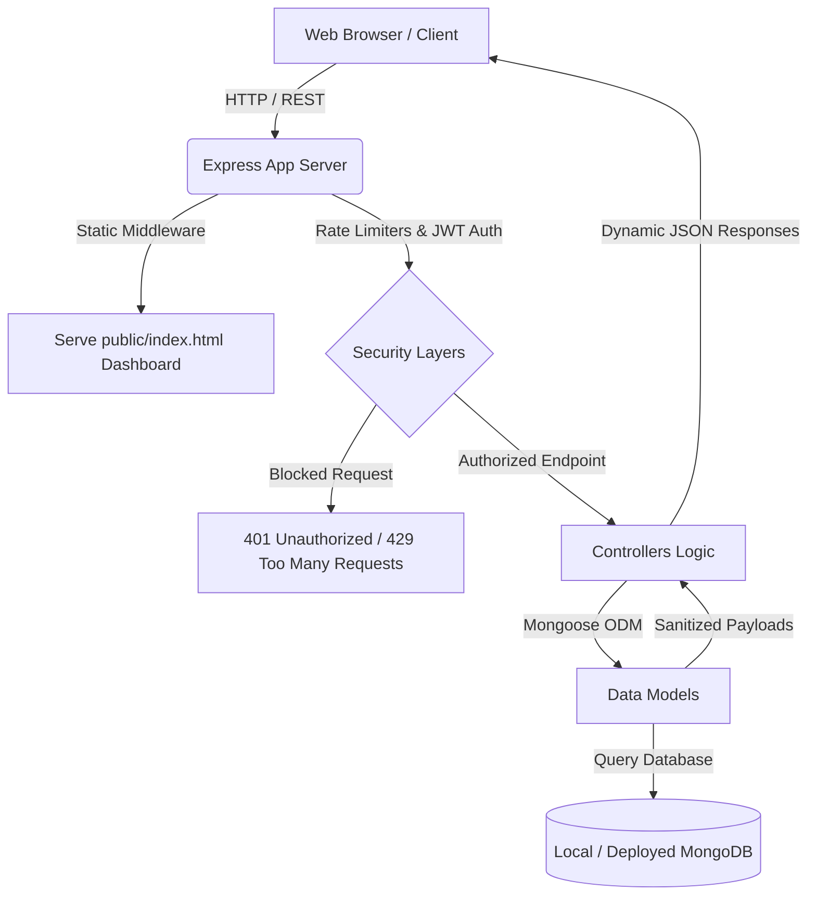

# 🕶️ MetaLens — Premium Meta Glasses Reviews Platform

MetaLens is a high-performance, full-stack reviews ecosystem built to aggregate, analyze, and manage customer experiences for the **Meta Ray-Ban Smart Glasses**. It couples a state-of-the-art **Glassmorphic Dark-Mode Dashboard (Frontend)** with a secure, highly robust **MVC RESTful API (Backend)** powered by Node.js, Express, and MongoDB.

---

## 🔗 Live Deployments & Documentation

*   **📄 Live API Documentation (Postman)**: [Explore Postman Collection Documentation](https://documenter.getpostman.com/view/YOUR_POSTMAN_DOC_LINK_HERE) 
*   **🚀 Live Backend Production Deployment**: https://meta-glasses-reviews-harshit-pandya.onrender.com/
*   **🌐 Local Web Dashboard**: http://localhost:5000/
---

## 📁 Project Folder Structure

This project follows a clean **Model-View-Controller (MVC)** design pattern, keeping data definitions, business controllers, routing maps, and public assets strictly decoupled.

```text
meta_glasses_reviews_harshit_pandya/
├── Meta-Glasses-Reviews.json        # Raw dataset containing smart glasses review records
├── README.md                        # Root platform documentation (this file)
└── backend/                         # Core API backend & served web assets
    ├── .env                         # Environment configurations (Port, DB URI, JWT keys)
    ├── package.json                 # Node package configuration & task scripts
    ├── server.js                    # Core entry point (middleware mount, DB connect, static serving)
    ├── config/                      # Database integration
    │   └── db.js                    # Mongoose MongoDB connection handler
    ├── models/                      # Mongoose validation schemas
    │   ├── User.js                  # User profile and secure credential schema
    │   └── Review.js                # Core Meta Glasses Review schema & format check rules
    ├── middlewares/                 # Security boundary layers
    │   ├── auth.js                  # Bearer JWT verification & role authorization checks
    │   └── rateLimiter.js           # Custom IP-tracking in-memory rate budgeting limits
    ├── controllers/                 # Business, statistical, and AI analysis logic
    │   ├── authController.js        # Authentication & profile state handshakes
    │   └── reviewController.js      # Aggregations, keyword search, & CRUD operations
    ├── routes/                      # REST API routing matrices
    │   ├── authRoutes.js            # Session handling, registration, and logout mappings
    │   ├── jwtRoutes.js             # Utility checking and JWT dashboard testers
    │   └── reviewRoutes.js          # Main reviews CRUD, stats, search, & bulk routes
    ├── services/                    # Automation utilities & integration suites
    │   ├── seed.js                  # Sanitization, batching, & bulk DB populating script
    │   └── test_api.js              # 100+ endpoint automated regression tests suite
    └── public/                      # Quantum Obsidian served frontend assets
        ├── index.html               # Semantic HTML5 Glassmorphic UI Dashboard structure
        ├── style.css                # Curated HSL dark palette & micro-animation rules
        └── app.js                   # Client APIs driver, state manager, & toast engines
```

---

## 🏗️ Technical Architecture Diagram



---

## 🌟 Key Platform Features

### 1. Quantum Obsidian Web Dashboard (Served at `/`)
*   **Unified Statistics Panels**: Instantly renders calculated Average Rating, Total Reviews count, verified purchase ratios, and active positive sentiment percentages directly from MongoDB.
*   **AI Copilot Review Synthesis**: Fetches direct pros, cons, and summary verdicts generated from raw text using custom backend analytics pipelines.
*   **Glassmorphic Aesthetic UI**: Beautiful Outfit typography, glowing HSL primary borders, sliding action modal sheets, responsive panels, and skeletal loading sheets.
*   **Interactive Controls**: Real-time filtering by rating levels, device type (`Wayfarer`/`Headliner`), verified status, countries, and keyword debounced searches.
*   **Direct CRUD Interactions**: Open modal dialogs to write verified reviews (incorporates real-time layout validations) and manage ratings.

### 2. Scalable RESTful API (Backend)
*   **100+ Verification Endpoints**: Covers basic CRUD, pagination sorting, statistical analytical parameters, and metadata checks.
*   **Robust Session Auth**: Standard Token Rotation (AccessToken + RefreshToken) coupled with simulated forgot-password verification code dispatches.
*   **IP-Based Rate Limiting**: Protects sensitive endpoints (bulk import limits, account deletion caps, sign-in brute-forcing prevention) via custom in-memory middleware tracking.

---

## 🚀 Local Getting Started Guide

### Prerequisites
*   **Node.js** (v18.0.0 or higher recommended)
*   **MongoDB** (Local instance running at `mongodb://localhost:27017` or a remote MongoDB Atlas URI)

### Setup Steps

1.  **Clone and Navigate to the Backend Folder**:
    ```bash
    cd meta_glasses_reviews_harshit_pandya/backend
    ```

2.  **Configure Environment Variables**:
    Create a `.env` file in the `backend/` directory:
    ```ini
    PORT=5000
    MONGODB_URI=mongodb://localhost:27017/meta_glasses_reviews
    JWT_SECRET=your_glowing_jwt_secret_key_here
    NODE_ENV=development
    ```

3.  **Install Platform Dependencies**:
    ```bash
    npm install
    ```

4.  **Seed the MongoDB Database**:
    Bulk import and sanitize the 10,000+ raw records from the root `Meta-Glasses-Reviews.json` file:
    ```bash
    node services/seed.js
    ```

5.  **Start the Platform Dev Server**:
    ```bash
    npm run dev
    ```
    *This runs the server in hot-reload mode via `nodemon` on **`http://localhost:5000`**.*

6.  **Run in Browser**:
    Simply open [http://localhost:5000/](http://localhost:5000/) in your web browser to access the interactive web dashboard.

7.  **Run Automated Integration Tests**:
    Verify endpoint status checks, token exchanges, custom validations, and error handlers:
    ```bash
    node services/test_api.js
    ```

---

## 🔒 Security Middleware Budgets

To guard the MongoDB infrastructure from excessive search index strain and bulk mutations, the custom rate limiting middleware applies these caps (resets every 60 seconds):

*   `POST /auth/register` - **5 registrations/min**
*   `POST /auth/login` - **10 attempts/min**
*   `GET /reviews` - **30 queries/min**
*   `GET /search` - **15 queries/min**
*   `POST /reviews` - **5 creations/min** *(Spam Prevention)*
*   `DELETE /reviews/:reviewID` - **5 deletions/min**
*   `POST /import/json` - **2 bulk uploads/min**
*   `GET /admin/*` - **10 requests/min**

*Note: Automated tests carrying the header `x-testing: true` automatically bypass rate caps to permit continuous integration flows.*

---

## 📊 Core API Endpoint Registry

### Authentication & Profile (JWT Protected)
*   `POST /auth/register` - Register new profile (validates strong passwords)
*   `POST /auth/login` - Log in user (returns Access + Refresh tokens)
*   `GET /profile` - Retrieve logged-in profile data (Requires Bearer token)
*   `PATCH /profile` - Update profile data fields
*   `DELETE /auth/account` - Permanently wipe profile credentials from DB

### Review CRUD Operations
*   `GET /reviews` - Fetch reviews (paginated, sorted, filtered)
*   `POST /reviews` - Submit review (conforms ID to `/^R[A-Z0-9]+$/` format)
*   `GET /reviews/:reviewID` - Retrieve single review details
*   `PUT /reviews/:reviewID` - Replace complete review payload
*   `PATCH /reviews/:reviewID/rating` - Direct Mongoose rating update
*   `DELETE /reviews/:reviewID` - Delete review record (Admin protected)

### Aggregations & Analytics
*   `GET /stats/average-rating` - Overall average rating calculation
*   `GET /reviews/ai-summary` - Pros, cons, and overview verdict synthesis
*   `GET /reviews/sentiment-analysis` - Positive, neutral, and negative ratio breakdowns
*   `GET /stats/top-reviewers` - Retrieve list of top 10 contributing reviewers
*   `GET /stats/monthly-average` - Monthly average fluctuations timeline
